# Introduction à Neo4j

(me:Human {name: 'Michel'})-[:PRESENTS]->(neo4j:Engine {name: 'Neo4j'})

---

## Présentations

**Michel Caradec** (mcaradec@hotmail.com)

<table>
  <tr>
    <td><center></center></td>
    <td><center></center></td>
    <td><center>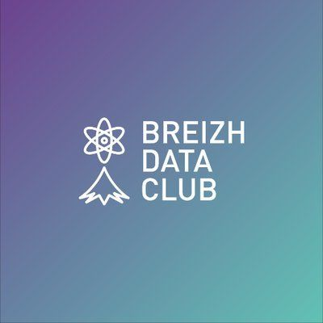</center></td>
  </tr>
  <tr>
  <td><center>[www.cegid.com](http://www.cegid.com/)</center></td>
  <td><center>[data-bzh.fr](http://data-bzh.fr/)</center></td>
  <td><center>[breizhdataclub.org](http://breizhdataclub.org/)</center></td>
  </tr>
</table>

Project Manager, Software/Data Engineer

---

## Agenda

- Etude de cas.
- Cypher Query Language.
- Utilisation avancée de Cypher.
- Pourquoi Neo4j ?
- Cas d'usage.

---

## Etude de cas

note:
Tout est relation => avantage modèle entité-relation vs graphe.

--

### Exemple de réseau : Data-Bzh

- Colin **EST CREATEUR** de Data-Bzh.
- Colin, Michel, Tristan **SONT CONTRIBUTEURS** sur Data-Bzh.
- Colin, Michel, Tristan **PROGRAMMENT EN** R.
- Colin **LIT** Proust.
- Michel **PRATIQUE** le Trail.

note:
Un micro-réseau : Data-Bzh, avec ses sujets et relations.

--

### Méta-Modèle

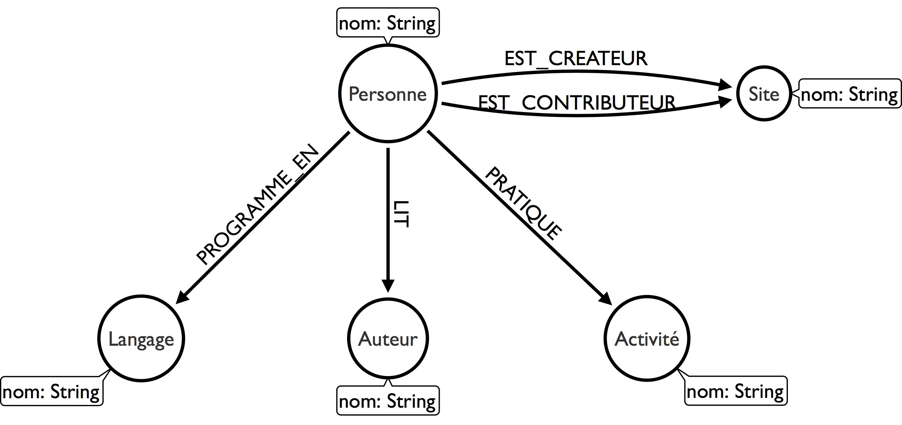

note:
Modélisation (méta-graphe).

--

### Modélisation SQL

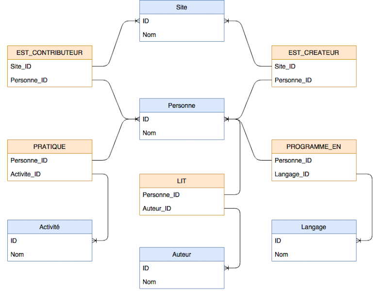

note:
Le modèle physique de données est complexe, peu intuitif et peu évolutif.
On retrouve les sujets (tables bleues) et les relations (tables oranges).
Ce MPD contient beaucoup de relations, avec une définition SQL complexe, et non orientée métier (i.e. pas proche de l'utilisateur).
L'ajout d'un nouveau type de sujet nécessitera la création de plusieurs tables (1 pour le sujet et 1 par type de relation).

--

### Modélisation SQL

```sql
CREATE TABLE Personne(ID integer PRIMARY KEY, Nom text);
CREATE TABLE Site(ID integer PRIMARY KEY, Nom text);
CREATE TABLE Activite(ID integer PRIMARY KEY, Nom text);
CREATE TABLE Auteur(ID integer PRIMARY KEY, Nom text);
CREATE TABLE Langage(ID integer PRIMARY KEY, Nom text);

CREATE TABLE EST_CREATEUR (
  Personne_ID integer REFERENCES Personne(ID), Site_ID integer REFERENCES Site(ID));
CREATE TABLE EST_CONTRIBUTEUR (
  Site_ID integer REFERENCES Site(ID), Personne_ID integer REFERENCES Personne(ID));
CREATE TABLE PROGRAMME_EN (
  Personne_ID integer REFERENCES Personne(ID), Langage_ID integer REFERENCES Langage(ID));
CREATE TABLE LIT (
  Personne_ID integer REFERENCES Personne(ID), Auteur_ID integer REFERENCES Auteur(ID));
CREATE TABLE PRATIQUE (
  Personne_ID integer REFERENCES Personne(ID), Activite_ID integer REFERENCES Activite(ID));
```

--

### Alimentation SQL

```sql
INSERT INTO Personne (ID, Nom) VALUES (1, 'Colin'), (2, 'Michel'), (3, 'Tristan')
INSERT INTO Site (ID, Nom) VALUES (1, 'Data-Bzh')
INSERT INTO Activite (ID, Nom) VALUES (1, 'Trail')
INSERT INTO Auteur (ID, Nom) VALUES (1, 'Proust')
INSERT INTO Langage (ID, Nom) VALUES (1, 'R')

INSERT INTO EST_CREATEUR (Site_ID, Personne_ID) VALUES (1, 1)
INSERT INTO EST_CONTRIBUTEUR (Personne_ID, Site_ID) VALUES (1, 1), (2, 1), (3, 1)
INSERT INTO PROGAMME_EN (Personne_ID, Langage_ID) VALUES (1, 1), (2, 1), (3, 1)
INSERT INTO LIT (Personne_ID, Auteur_ID) VALUES (1, 1)
INSERT INTO PRATIQUE (Personne_ID, Activite_ID) VALUES (2, 1)
```

--

Modélisation plus naturelle ?

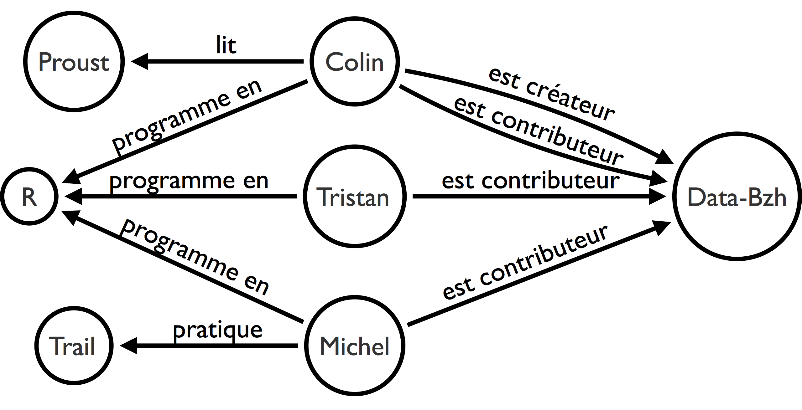

note:
Notre micro-réseau tel que nous le dessinerions sur un tableau.
Une telle modélisation est possible avec Neo4j et Cypher.

---

## Neo4j

<center></center>

- Société **[Neo4j, Inc.](https://neo4j.com/)**.
- Base de données **orientée graphes**, **NoSQL**.
- Première version en **février 2000**.
- Deux éditions :
  - **Neo4j Community**.
  - **Neo4j Entreprise**.

note:
Société renommée en 09/2017, anciennement Neo Technology.
Neo4j Community (GPLv3).
Neo4j Entreprise (AGPLv3 et commerciale).

---

## Cypher Query Language

Modéliser et interroger en **ASCII Art**.

```raw
 _____ _     _       _          _    ____   ____ ___ ___      _         _     _ 
|_   _| |__ (_)___  (_)___     / \  / ___| / ___|_ _|_ _|    / \   _ __| |_  | |
  | | | '_ \| / __| | / __|   / _ \ \___ \| |    | | | |    / _ \ | '__| __| | |
  | | | | | | \__ \ | \__ \  / ___ \ ___) | |___ | | | |   / ___ \| |  | |_  |_|
  |_| |_| |_|_|___/ |_|___/ /_/   \_\____/ \____|___|___| /_/   \_\_|   \__| (_)
```

note:
http://www.ascii-art-generator.org/
Le plus simple pour commencer avec Neo4j est d'utiliser Cypher.
Ce langage d'interrogation déclaratif est aussi une des forces de Neo4j.
Gremlin, souvent cité, est un langage d'interrogation impératif.
Rappel : dans un langage déclaratif, les détails d'exécution ne sont pas indiqués (c'est le moteur d'exécution qui s'en charge), contrairement à un langage impératif, pour lequel l'exécution sera déterminée par l'implémentation de l'algorithme.

--

### Formalisme

- Phrase : <span style="color:#445193">**Sujet**</span> - <span style="color:#B42EB5">**Verbe**</span> - <span style="color:#445193">**Objet**</span>.
- Chemin : <span style="color:#445193">**noeud départ**</span> - <span style="color:#B42EB5">**relation**</span> - <span style="color:#445193">**noeud arrivée**</span>.
  - <span style="color:#445193">**Noeuds**</span> encadrés par des parenthèses **()**.
  - <span style="color:#B42EB5">**Relations**</span> encadrées par des crochets **[]**.
  - Connexions matérialisées par des flèches **-->**.

<span style="font-size: 40pt">
<span style="color:#445193">(noeud départ)</span>-<span style="color:#B42EB5">[:RELATION]</span>-><span style="color:#445193">(noeud arrivée)</span>
</span>

<span style="font-size: 30pt">
Ex.: <span style="color:#445193">(Michel)</span>-<span style="color:#B42EB5">[:CONTRIBUE]</span>-><span style="color:#445193">(Data-Bzh)</span>
</span>

note:
La description d'un réseau peut se faire sous la forme de phrases de type sujet - verbe - objet (ex.: "Colin lit Proust"). La description d'une relation suit le même principe (noeud - relation - noeud).
On constate que la où SQL requiert de créer une structure (relativement figée) organisée autour de tables, puis de les alimenter, Neo4j ne nécessite aucun schéma préalable.
Le schéma physique est le modèle tel qu'on le dessinerait sur un tableau.
Il suffit simplement de déclarer les noeuds et relations selon un formalisme très visuel similaire à du **[ASCII Art](https://fr.wikipedia.org/wiki/Art_ASCII)**, avec une structure de type `(noeud départ)-[:RELATION]->(noeud arrivée)`, les noeuds étant encadrés par des parenthèses, les relations par des crochets, le tout étant lié par des flèches, un peu comme ce que nous ferions si nous étions amenés à dessiner un schéma sur un tableau.

--

### Formalisme

- <span style="color:#445193">**Propriétés**</span> sur les noeuds et relations.
- <span style="color:#B42EB5">**Labels**</span> sur les noeuds.
- Les relations sont -**dirigées**->.
- Les <span style="color:#00B400">**variables**</span> identifient les noeuds et relations dans la requête.

<span style="font-size: 25pt">
(<span style="color:#00B400">me</span>:<span style="color:#B42EB5">Person</span> <span style="color:#445193">{name: 'Michel', interest: 'Data'}</span>)-[:CONTRIBUE <span style="color:#445193">{since: 2016}</span>]->(<span style="color:#00B400">data_bzh</span>:<span style="color:#B42EB5">Site</span> <span style="color:#445193">{url: 'www.data-bzh.fr'}</span>)
</span>

note:
Les noeuds représentent des noms, leurs propriétés des adjectifs.
Les relations représentent des verbes, leurs propriétés des adverbes.

--

### Création des noeuds

```
CREATE
  (colin:Personne {nom: 'Colin'}),
  (michel:Personne {nom: 'Michel'}),
  (tristan:Personne {nom: 'Tristan'}),
  (data_bzh:Site {nom: 'Data-Bzh'}),
  (trail:Activite {nom: 'Trail'}),
  (proust:Auteur {nom: 'Proust'}),
  (r:Langage {nom: 'R'})
```

note:
Les noeuds peuvent-être regroupés par familles, grâce aux **labels** : `(:Personne)` représente un noeud avec le label "Personne".
Il est possible pour des noeuds de même label d'avoir des **propriétés** différentes, et pour un noeud d'avoir plusieurs labels.

--

### Création des relations

```
CREATE
  (colin)-[:EST_CREATEUR]->(data_bzh),
  (colin)-[:EST_CONTRIBUTEUR]->(data_bzh),
  (michel)-[:EST_CONTRIBUTEUR]->(data_bzh),
  (tristan)-[:EST_CONTRIBUTEUR]->(data_bzh),
  (colin)-[:PROGRAMME_EN]->(r),
  (michel)-[:PROGRAMME_EN]->(r),
  (tristan)-[:PROGRAMME_EN]->(r),
  (colin)-[:LIT]->(proust),
  (michel)-[:PRATIQUE]->(trail)
```

--

### Commande Cypher complète

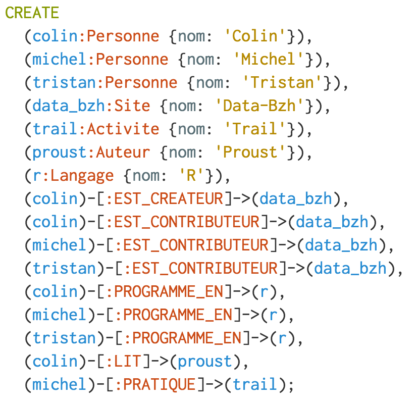

<!--
```cypher
CREATE
  (colin:Personne {nom: 'Colin'}),
  (michel:Personne {nom: 'Michel'}),
  (tristan:Personne {nom: 'Tristan'}),
  (data_bzh:Site {nom: 'Data-Bzh'}),
  (trail:Activite {nom: 'Trail'}),
  (proust:Auteur {nom: 'Proust'}),
  (r:Langage {nom: 'R'}),
  (colin)-[:EST_CREATEUR]->(data_bzh),
  (colin)-[:EST_CONTRIBUTEUR]->(data_bzh),
  (michel)-[:EST_CONTRIBUTEUR]->(data_bzh),
  (tristan)-[:EST_CONTRIBUTEUR]->(data_bzh),
  (colin)-[:PROGRAMME_EN]->(r),
  (michel)-[:PROGRAMME_EN]->(r),
  (tristan)-[:PROGRAMME_EN]->(r),
  (colin)-[:LIT]->(proust),
  (michel)-[:PRATIQUE]->(trail);
```
-->

note:
Cypher a permis en une seule commande de déclarer la structure du graphe, et de l'alimenter.

--

### Recherche Simple

- **MATCH** : recherche de motifs (patterns) dans le graphe.
- **RETURN** : retourne un résultat :
  - Sous-graphe.
  - Rowset.

```
MATCH (n)
RETURN *;
```

--

### Recherche Simple

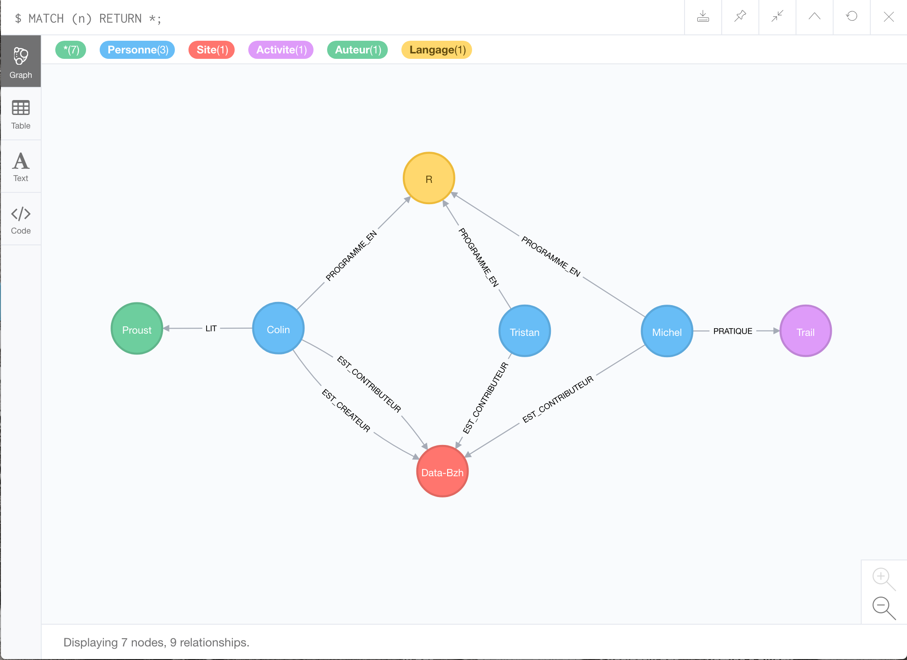

--

### Recherche par Pattern

Recherche d'une **personne**.

```
MATCH (n:Personne {nom: 'Colin'})
RETURN n;
```

ou

```
MATCH (n:Personne)
WHERE n.nom = 'Colin'
RETURN n;
```

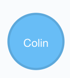

<!--  -->

--

### Recherche par Pattern

Recherche d'une **personne** et de ses **relations**.

```
MATCH (c:Personne {nom: 'Colin'})-[]-(o)
RETURN *;
```

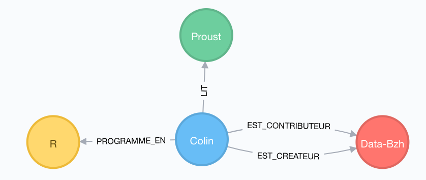

--

### Recherche par Pattern

Recherche des **contributeurs** d'un **site**.

```
MATCH (c)-[:EST_CONTRIBUTEUR]->(s:Site {nom: 'Data-Bzh'})
RETURN *;
```


--

### Possible aussi en SQL

```sql
SELECT Nom
FROM Personne, EST_CONTRIBUTEUR, Site
WHERE Personne.ID = EST_CONTRIBUTEUR.Personne_ID
  AND EST_CONTRIBUTEUR.Site_ID = Site.ID
  AND Site.Nom = 'Data-Bzh'
```

Quel est l'intérêt de l'approche graphe ?

--

### Recherche multi-niveaux

```
MATCH (n:Personne {nom: 'Colin'})-[*..2]-(o)
RETURN *;
```

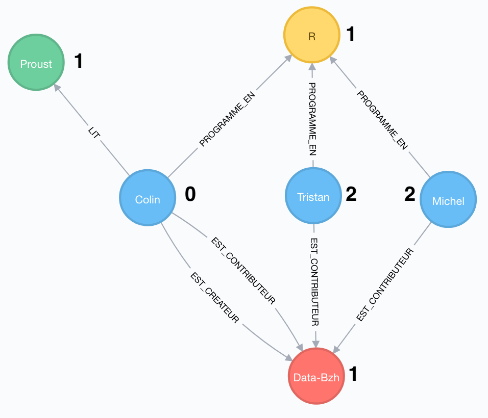

Beaucoup plus compliqué en SQL (sans parler des performances) !

note:
La dénormalisation d'une base relationnelle est certe possible dans le but d'améliorer les performances, mais celles-ci resteront limitées au nombre de degrés (qui devra rester modeste = 3 maximum) pour lequel la dénormalisation a été prévue.
Dès que le nombre de degrés augmentera (même de 1), le modèle ne sera plus adapté, entraînant une baisse considérable des performances.
Dans l'exemple présenté, on peut imaginer remplacer les noeuds provenant de Data-Bzh par les composants d'un système d'information (serveur, routeur, proxy, carte réseau, etc.) et les relations par des liens de dépendance, pour la détection de SPOF (Single Point Of Failure).

---

## Utilisation avancée de Cypher

--

### Les Meetup Rennais

```
CALL db.schema();
```

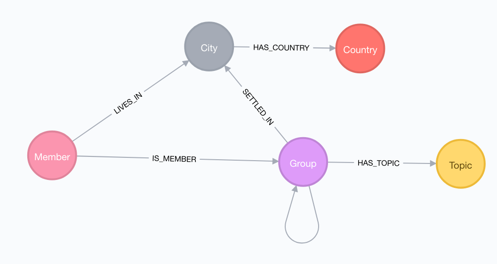

*Données collectées le 24/09/2017.*

--

### Chemin le plus court

```
WITH
    133297112 AS Me, // Michel
    "Communauté vidéo iPhone Bretagne" AS TargetGroupName,
    ["Meetup La French Tech Rennes St Malo"] AS ExcludeGroupNames
MATCH (me:Member {id: Me})-[:IS_MEMBER]->(g_me:Group)
WHERE NOT g_me.name IN ExcludeGroupNames
MATCH path=shortestPath((g_me:Group)-[:HAS_COMMON_MEMBERS*..3]-(g_target:Group {name: TargetGroupName}))
RETURN me, path, length(path) AS RelCount
ORDER BY RelCount ASC
LIMIT 1;
```

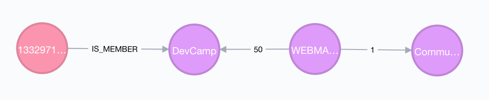

note:
Partons du principe que l'inscription dans un nouveau groupe nécessite d'être coopté par un membre de ce groupe, et que la cooptation n'est possible que si cette personne est membre d'un de nos groupes.
Exemple :
A est membre du groupe G1.
B est membre du groupe G1 et G2.
C est membre du groupe G2 et G3.
1. B peut coopter A pour qu'il devienne membre du groupe G2.
2. C sera alors en mesure de coopter A pour qu'il devienne membre du groupe G3.
Le parcours de cooptation pour A afin de devenir membre du groupe G3 sera : G1->G2->G3.
En l'état actuel des relations, par combien de groupes faudra-t'il s'inscrire pour être admis dans un groupe cible ?

--

### Filtre collaboratif

```
WITH
    // Identifiant de la personne pour laquelle effectuer une recommandation
    133297112 AS Me // Michel
// 1. Groupes (g_reco) des membres (other) de mes (me) groupes (g_me)...
MATCH (me:Member {id: Me})-[:IS_MEMBER]->(g_me:Group)<-[:IS_MEMBER]-(other:Member)-[:IS_MEMBER]->(g_reco:Group)
WHERE
    // ... dont je ne suis pas membre
    NOT (me)-[:IS_MEMBER]->(g_reco)
WITH
    // Groupes dont je ne suis pas membre 
    DISTINCT g_reco AS RecommendedGroups,
    // Nombre de membres en commun avec ce groupe
    COUNT(DISTINCT other) AS CommonMemberCount
    ORDER BY CommonMemberCount DESC
// 2. Noms des groupes recommandés, avec le nombre de membres en commun (tableau)
RETURN
    RecommendedGroups.name AS Groupes,
    CommonMemberCount AS NbMembresCommuns
LIMIT 5;
```

--

### Filtre collaboratif

| Groupes | NbMembresCommuns |
|---|---|
| "UX Rennes" | 670 |
| "Le Shift" | 669 |
| "Agile Rennes" | 636 |
| "La Cordée Rennes - partage, événements et bonne humeur" | 634 |
| "RennesJS" | 545 |

--

### Page Rank

- Détermine la **popularité** d'une page web.
- Rapport entre les **liens sortants** (mentions) et les **liens entrants** (citations).
- Algorithme **itératif**.

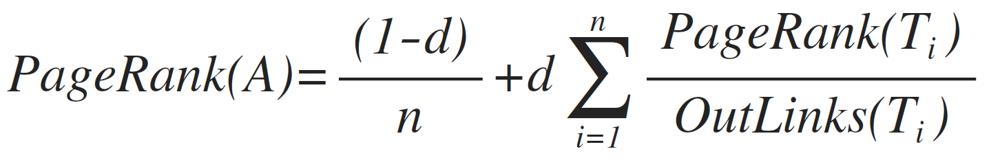

note:
Formule Latex:
PageRank(A)=\frac{(1-d)}{n}+d\sum_{ i=1 }^{ n }{ \frac { PageRank(T_i) }{ OutLinks(T_i) } }

--

### Page Rank

Utilisation de l'extension **[Neo4j Graph Algorithms](https://neo4j-contrib.github.io/neo4j-graph-algorithms/)**.

```
CALL algo.pageRank.stream('Group', 'MEMBERS_ALSO_GO', {iterations: 30})
YIELD node, score
RETURN
  node.name AS Groupe,
  score AS Score
ORDER BY score DESC
LIMIT 5;
```

note:
https://neo4j-contrib.github.io/neo4j-graph-algorithms/#_page_rank
Ajout d'une relation bi-directionnelle MEMBERS_ALSO_GO (HAS_COMMON_MEMBERS étant uni-directionnel, et favorisant de ce fait un groupe au détriment de l'autre).
  MATCH (g1:Group)<-[:IS_MEMBER]-(m:Member)-[:IS_MEMBER]->(g2:Group)
  WHERE g1 <> g2
  CREATE (g1)-[:MEMBERS_ALSO_GO]->(g2);

--

### Page Rank

| Groupe | Score |
|---|---|
| "Meetup La French Tech Rennes St Malo" | 1.08 |
| "WEBMARKETING Rennes" | 1.08 |
| "La Cordée Rennes - partage, événements et bonne humeur" | 1.01 |
| "UX Rennes" | 1.01 |
| "Le Shift" | 1.01 |

--

### Clustering

Détection de communautés selon la méthode de **Louvain**.

```
CALL algo.louvain(
  'MATCH (g:Group) RETURN id(g) AS id',
  'MATCH (g1:Group)-[rel:HAS_COMMON_MEMBERS]-(g2:Group)'
  + 'WHERE rel.weight > 100 RETURN id(g1) as source, id(g2) as target',
  {graph: "cypher", writeProperty: "community"}
);
```

Persistance dans chaque noeud dans la propriété **community**.

note:
https://tbgraph.wordpress.com/2017/11/17/neo4j-marvel-social-graph-algorithms-community-detection/
Louvain: https://groupefmr.hypotheses.org/544

--

### Clustering

```
// Communauté avec le plus grand nombre de membres.
MATCH (g:Group)
WITH g.community AS Community, COUNT(g) AS Count
ORDER BY Count DESC
WITH head(collect(Community)) AS TopCommunity
// Membres de la communauté.
MATCH (g:Group {community: TopCommunity})
RETURN TopCommunity, collect(g.name) AS Groupes;
```

Exploitation de la propriété **community**.

--

| TopCommunity | Groupes |
|---|---|
| 101 | "Meetup E-Learning Rennes", "Le Hubzh", "ZikLab Rennes", "Meetup Codéveloppement professionnel et managérial Rennes", "Dolibarr Rennes et alentours", "Économie Circulaire Rennes", "Prospérer", "IMIE'TING", "JCE Rennes", "Le bien-être au service des professionnels", "Meetup Photographie Pro (Rennes)" |

---

## Pourquoi Neo4j ?

- **Expressivité** du modèle, simplicité d'utilisation.
- **Evolutivité** du modèle (NoSQL).
- Stockage orienté **relations** (optimisé pour les graphes).
- **Cypher** Query Language.
- **Extensibilité** (API).

note:
Neo4j est permissif dans l'évolution du modèle : les erreurs de design peuvent-être aisément corrigées, ce qui s'avère intéressant, notamment en phase de prototypage.

---

## Cas d'usage

- Réseaux sociaux.
- Recommandation.
- Logistique, géo-spatial.
- Master Data Management.
- Gestion ressources IT.
- Détection de fraudes.
  - [Panama Papers](https://github.com/michelcaradec/Panama-Papers).
  - [Paradise Papers](https://github.com/michelcaradec/Paradise-Papers).

note:
L'ETL de Talend a été utilisé pour l'alimentation pour les Panama Papers et les Paradise Papers.

---

### Pour aller plus loin avec Neo4j

- Cypher : https://neo4j.com/developer/cypher/.
  - Awesome Procedures On Cypher (APOC) : https://github.com/neo4j-contrib/neo4j-apoc-procedures.
  - Graph Algorithm : https://github.com/neo4j-contrib/neo4j-graph-algorithms.
- Open Cypher : https://www.opencypher.org/.

--

### Pour aller plus loin avec Neo4j

- API, User Defined Functions, Server Extensions : https://neo4j.com/developer/java/.
- Drivers : Java, Python, R, .NET...
- Neo4j Desktop : https://neo4j.com/download/.
- Neo4j Sandbox : https://neo4j.com/sandbox-v2/.
- Neo4j Cloud : https://neo4j.com/cloud/.

--

### Articles

Data-Bzh

- http://data-bzh.fr/groupes-meetup-a-rennes-partie-1/
- http://data-bzh.fr/groupes-meetup-a-rennes-partie-2/
- http://data-bzh.fr/groupes-meetup-a-rennes-partie-3-neo4j/

Théorie des graphes

- https://github.com/michelcaradec/Graph-Theory

---

## Conclusion

<span style="font-size: 60pt; color:#000000">
<span style="text-align: justify; display:block;">MATCH <span style="color:#445193">(<span style="color:#00B400">everybody</span>:Human)</span></span>
<span style="text-align: justify; display:block;">MATCH <span style="color:#445193">(<span style="color:#00B400">neo4j</span>:Engine {name: 'Neo4j'})</span></span>
<span style="text-align: justify; display:block;">MERGE <span style="color:#445193">(<span style="color:#00B400">everybody</span>)</span>-<span style="color:#B42EB5">[:LIKE]</span>-><span style="color:#445193">(<span style="color:#00B400">neo4j</span>)</span>;</span>
</span>

note:
J'espère que cette présentation vous aura donné envie d'explorer les capacités de Neo4j.

---

**Merci de votre attention.**

---

## Questions & Réponses

---

## One More Thing...

--

### Quel modèle de données ?


*Critères de décision non-exhaustifs.*

note:
- Relationel : gestion des accès concurrents (transactions, full consistency), avec un fort besoin de contraintes d'intégrité.
- Document : essentiellement des relations 1-N (regroupement par document), peu de relations N-N.
- Graphe : nombreuses relations N-N.
Autre critère de sélection : si le diamètre du graphe est supérieur à 5, alors utiliser obligatoirement une base de données graphe.

--

### Representing a property graph using a relational schema

```sql
CREATE TABLE vertices (
  vertex_id integer PRIMARY KEY,
  properties json
);

CREATE TABLE edges (
  edge_id integer PRIMARY KEY,
  tail_vertex integer REFERENCES vertices (vertex_id),
  head_vertex integer REFERENCES vertices (vertex_id),
  label text,
  properties json
);

CREATE INDEX edges_tails ON edges (tail_vertex);
CREATE INDEX edges_heads ON edges (head_vertex);
```

*Designing Data-Intensive Applications*

*Martin Kleppmann, éditions O'Reilly, ISBN 978-1-449-37332-0*
