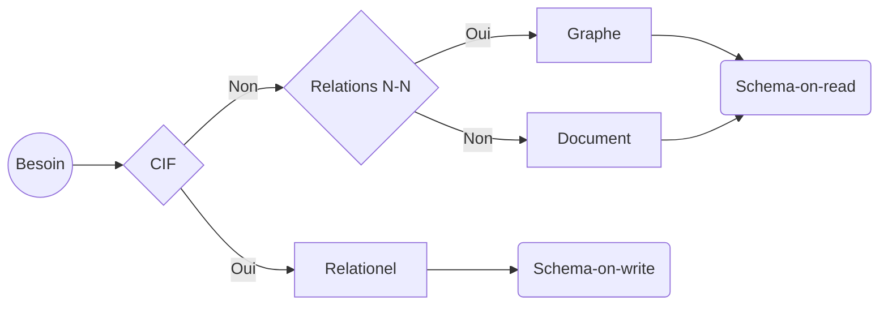

```mermaid
graph LR;
  A((Besoin)) -->B{CIF}
  B-->|Oui| REL[Relationel]
  B-->|Non| C{Relations N-N}
  C-->|Oui| GR[Graphe]
  C-->|Non| DOC[Document]
  REL-->SW(Schema-on-write)
  GR-->SR(Schema-on-read)
  DOC-->SR(Schema-on-read)
```
